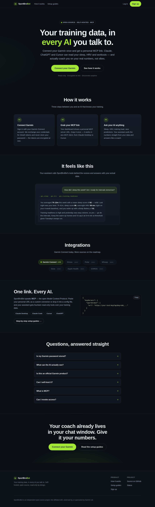
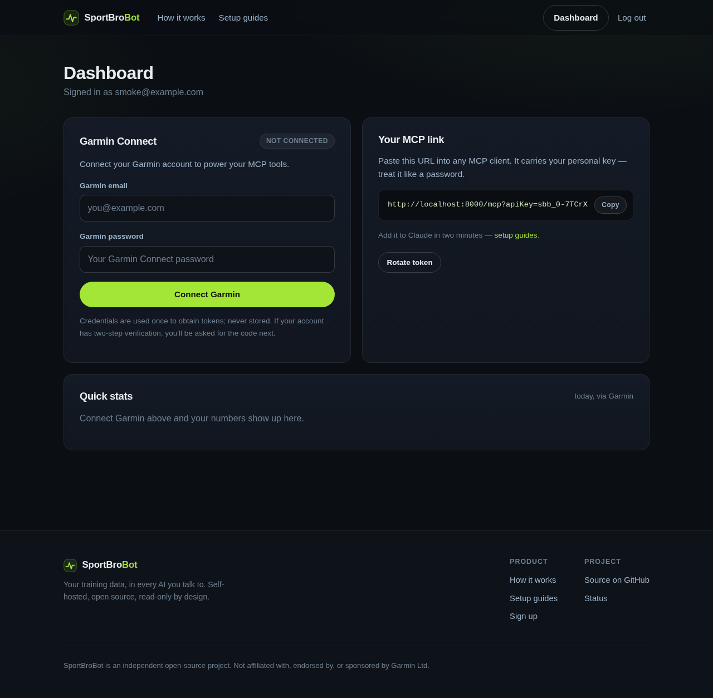
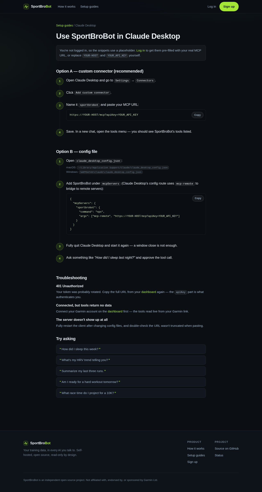

# SportBroBot

**Your training data, in every AI you talk to.**

SportBroBot is a self-hostable web app inspired by [athletedata.health](https://www.athletedata.health/):
connect your **Garmin Connect** account once, grab your **personal MCP server
link**, and chat with your real training data — sleep, HRV, workouts, training
readiness — inside Claude, ChatGPT, Cursor, or any MCP client.



## What you get

- **Garmin Connect integration** — sign in once (MFA supported); SportBroBot
  exchanges your credentials for OAuth tokens and never stores your password.
  Tokens are Fernet-encrypted at rest and refresh automatically.
- **Strava integration (real OAuth)** — users click "Connect with Strava" and
  sign in on strava.com itself; SportBroBot receives read-only tokens and
  refreshes them automatically. See [Strava setup](#strava-setup).
- **A personal MCP server link** — `https://your-host/mcp?apiKey=sbb_...` —
  exposing **18 read-only tools** over MCP streamable HTTP: 14 Garmin tools
  (`get_athlete_profile`, `get_daily_summary`, `list_activities`,
  `get_activity_details`, `get_sleep`, `get_hrv`, `get_training_status`,
  `get_training_readiness`, `get_body_battery`, `get_stress`, `get_steps`,
  `get_heart_rate`, `get_race_predictions`, `get_body_composition`) plus 4
  Strava tools (`strava_get_athlete`, `strava_get_athlete_stats`,
  `strava_list_activities`, `strava_get_activity`).
- **A dashboard** with your Garmin link status, quick stats, and your MCP URL
  with one-click copy and token rotation.
- **Per-client setup guides** at `/mcp/setup` — step-by-step instructions for
  Claude Desktop (custom connector or `mcp-remote` config), Claude Code,
  Cursor, and ChatGPT.



## Quickstart

Requires Python 3.11+.

```bash
python -m venv .venv && . .venv/bin/activate
pip install -e ".[dev]"
python run.py            # serves http://localhost:8000
```

Then:

1. Open http://localhost:8000 and **sign up**.
2. On the dashboard, **connect your Garmin account** (you'll be asked for the
   MFA code if your account has two-step verification).
3. **Copy your MCP link** and add it to your AI client — guides at
   [/mcp/setup](http://localhost:8000/mcp/setup).

### Add to Claude Desktop

Settings → Connectors → **Add custom connector**, name it `sportbrobot`, paste
your MCP URL. Or via `claude_desktop_config.json`:

```json
{
  "mcpServers": {
    "sportbrobot": {
      "command": "npx",
      "args": ["mcp-remote", "https://your-host/mcp?apiKey=YOUR_API_KEY"]
    }
  }
}
```

### Add to Claude Code

```bash
claude mcp add --transport http sportbrobot "https://your-host/mcp?apiKey=YOUR_API_KEY"
```

Then ask things like *“How did I sleep this week?”*, *“Am I ready for
intervals tomorrow?”*, or *“Summarize my last three runs.”*



### Strava setup

1. Create an API application at [strava.com/settings/api](https://www.strava.com/settings/api)
   (any Strava account can — it's instant and free). Set **Authorization
   Callback Domain** to your deployment's host (`localhost` for local use).
2. Put the Client ID and Client Secret in the environment:
   `SPORTBRO_STRAVA_CLIENT_ID` / `SPORTBRO_STRAVA_CLIENT_SECRET`.
3. Restart, open the dashboard and click **Connect with Strava** — you sign
   in on Strava's own page and approve read-only access.

Strava's default app rate limits are 200 requests / 15 min and 2,000 / day;
SportBroBot's caching keeps normal MCP usage well under that.

### Verifying a Garmin login end to end

Garmin has no self-serve API; SportBroBot signs in with the user's
credentials against Garmin's SSO (same endpoints the Connect apps use).
Garmin's bot protection often blocks datacenter/VPN IPs, so verify from a
normal connection:

```bash
.venv/bin/python scripts/verify_garmin_login.py
```

It performs a real login (MFA supported) and pulls your profile, daily
summary, sleep and recent activities through the exact code paths the app
uses. For the official partner route (real "Sign in with Garmin" OAuth,
webhooks), see [docs/garmin-partner-access.md](docs/garmin-partner-access.md).

## Configuration

Everything works with zero config for local use (secrets are generated and
persisted under `./data/`). For deployments, see [.env.example](.env.example):

| Variable | Purpose | Default |
|---|---|---|
| `SPORTBRO_BASE_URL` | Public URL used to build your MCP link | `http://localhost:8000` |
| `SPORTBRO_DATABASE_URL` | SQLAlchemy URL | `sqlite:///./data/sportbrobot.db` |
| `SPORTBRO_SECRET_KEY` | Session cookie signing key | generated → `data/secret_key` |
| `SPORTBRO_FERNET_KEY` | Encryption key for Garmin/MCP tokens | generated → `data/fernet_key` |
| `SPORTBRO_DATA_DIR` | Where the DB and generated keys live | `./data` |
| `SPORTBRO_STRAVA_CLIENT_ID` | Strava API app client id | unset (Strava card explains setup) |
| `SPORTBRO_STRAVA_CLIENT_SECRET` | Strava API app client secret | unset |

## Security model

- Garmin **credentials are used once** to obtain OAuth tokens and never
  persisted; the token bundle is encrypted (Fernet) at rest.
- MCP tokens are stored as SHA-256 hashes for lookup; treat your MCP URL like
  a password and **rotate it** from the dashboard if it leaks. Note that the
  `?apiKey=` form appears in server access logs — clients that support custom
  headers (Claude Code, Cursor) can use `Authorization: Bearer <token>`
  against plain `/mcp` instead.
- All Garmin tools are **read-only**.
- App sessions are signed, HTTP-only cookies.

## Architecture

See [ARCHITECTURE.md](ARCHITECTURE.md). Short version: FastAPI + SQLite +
Jinja2; [`garminconnect`](https://pypi.org/project/garminconnect/) for the
Garmin session; the official [MCP Python SDK](https://pypi.org/project/mcp/)
(FastMCP, stateless streamable HTTP) mounted at `/mcp` behind token-auth
middleware that accepts `?apiKey=`, `Authorization: Bearer`, or a path token.

## Development

```bash
pytest             # 62 tests, no live Garmin calls
uvicorn sportbrobot.main:app --reload
```

## Disclaimers

SportBroBot is an independent open-source project — not affiliated with,
endorsed by, or sponsored by Garmin Ltd. It talks to Garmin Connect through
the same web API the Garmin Connect apps use; heavy polling can trip Garmin's
rate limits, so be gentle. Roadmap: Strava, Polar, Whoop, Oura and friends.
